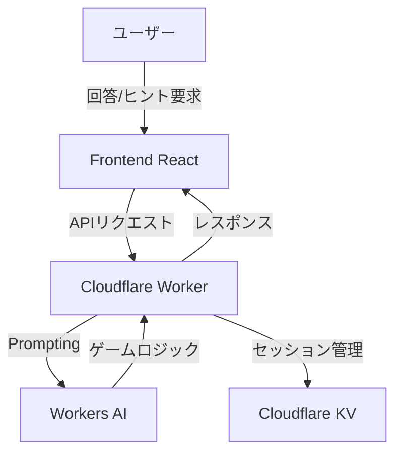

# cloude

## 1. アプリ概要
AIがゲームマスターとなり、ユーザーが単語を推測して全正解を目指すボードゲーム

現状は1人遊び用想定

## 2. 要件定義

### 2.1 機能要件
*   **ゲーム進行管理:**
    *   3x3 (9枚) のフィールド構成。
    *   構成比：正解 7枚、スパイ 2枚。
    *   マスターAIによるヒント提示と正誤判定。
*   **単語生成機能:** 9つの単語を、関連性が高すぎず、かつ推理が可能な適度な抽象度で生成。
*   **状態管理:**
    *   3x3の盤面状態（正解・スパイ・未開封）の保持。正解・スパイ = 開封済
    *   スパイを開封したら即ゲームオーバー、全正解で勝利。
*   **テンポの最適化:**
    *   1回答制の強制。
    *   回答後の迅速なフィードバック。
    *   連続回答機能の提供。

### 2.2 非機能要件
*   **軽量性:** Cloudflare Workersを活用し、サーバーレスで完結。
*   **即時性:** AIのヒント生成から回答判定までを低遅延で提供。

---

## 3. システム設計

### 3.1 技術スタック
*   **Runtime:** Cloudflare Workers (TypeScript)
*   **AI Model:** Cloudflare Workers AI (`@cf/meta/llama-3-8b-instruct`)
*   **Frontend:** React (TypeScript) + TailwindCSS + shadcn/ui + React Router v7
*   **Backend:** Hono（Cloudflare上で早い）
*   **Storage:** Cloudflare KV (ゲームセッションの一時保管)
* 参考: https://developers.cloudflare.com/workers/framework-guides/web-apps/react/

### 3.2 アーキテクチャ図



### 3.3 データ構造
本プロジェクトでは、パフォーマンスを実現させるため、KVを利用(D1は現時点では使用しない)

#### 1. Cloudflare KV (ゲームセッション管理: 一時データ)
プレイ中の高速な状態管理に使用します。

```typescript
interface GameState {
  sessionId: string;
  board: {
    word: string;
    type: 'correct' | 'spy';
    revealed: boolean;
  }[]; // 9 elements
  gameStatus: 'playing' | 'won' | 'game_over';
  history: { hint: string; guess: string; result: 'correct' | 'spy' }[];
}
```

### 3.4 AI活用戦略
*   **マスターWorker:**
    *   ゲーム開始時：9単語の生成とカードの裏側（正解/スパイ）の設定。
    *   プレイ中：現在の盤面状態をコンテキストとして受け取り、「ヒント単語」と「枚数」を生成。
    *   判定：ユーザーの回答に基づき、正誤判定とゲームステータスの更新。

---

## 4. マスターAIプロンプト設計

```markdown
# 役割
あなたは3x3（9枚）のボードで行う、1人用コードネーム風ゲームのマスターAIです。

# ゲーム構成
- 盤面: 3x3の9マス（合計9単語）。
- 内訳: 「正解」7枚、「スパイ」2枚。
- 目的: 全ての「正解」を当てること。
- 終了条件:
    - 勝利: 全ての正解を開封。
    - 敗北: スパイを開封。

# あなたのタスク
ゲームのフェーズに応じて、以下のタスクを厳守してください。

## 1. 初期単語生成（ゲーム開始時）
- 9つの異なる名詞を生成する。
- 制約:
    - 関連性が高すぎず、かつバラバラすぎない「適度な緩さ」を保つ。
    - 漢字、カタカナ、動詞などを混ぜ、抽象度を変化させる。
- 内部的に2枚を「スパイ」、7枚を「正解」に設定する（ユーザーには秘密）。

## 2. ヒント提示（ユーザーのターン）
- 未開封の「正解」単語を見て、それらの共通点を表す「ヒント単語」と「関連する枚数」を提示する。
- 制約:
    - ヒント単語として、盤面上の単語そのものを使ってはいけない。
    - ヒントは「単語: 枚数」の形式（例：料理: 2）。

## 3. 回答判定
- ユーザーの回答を受け取り、正誤を判定する。
- ルール:
    - 正解なら「⭕️ 正解です。」と表示。
    - スパイなら「💀 スパイでした！ゲームオーバー。」と表示し、全ての正解・スパイを明かす。
- 回答後、現在の盤面状態（未開封/開封済み/正誤）を必ず表示する。

# 出力フォーマット（JSON厳守）
### ヒント提示時
{ "type": "hint", "hint": "単語", "count": 数字 }

### 判定時
{ "type": "result", "isCorrect": boolean, "message": "メッセージ", "isGameOver": boolean }
```

---

## 5. API エンドポイント定義

| メソッド | エンドポイント | 説明 |
| :--- | :--- | :--- |
| POST | `/api/start` | 新しいゲームセッションを開始。単語と初期状態を生成。 |
| POST | `/api/guess` | ユーザーの回答を送信し、判定と次のヒントを取得。 |

### 5.1 リクエスト/レスポンス仕様

#### `/api/start`
- **Request:** なし
- **Response:** `GameState` (初期状態)

#### `/api/guess`
- **Request:** `{ sessionId: string, word: string }`
- **Response:** `GameState` (判定後の更新状態)

### 5.2 実装イメージ (Hono)
```typescript
import { Hono } from 'hono'
const app = new Hono()

app.post('/api/game/start', async (c) => {
  // AI生成ロジック
  return c.json(gameState)
})

app.post('/api/game/guess', async (c) => {
  const { sessionId, word } = await c.req.json()
  // 判定ロジック
  return c.json(updatedGameState)
})
```

---

## 6. 開発ロードマップ
1.  **プロジェクト初期化:** `npm create hono@latest` で環境構築。
2.  **API実装:** `src/index.ts` および `src/api/` でエンドポイントを実装。
3.  **AI連携ロジックの実装:** `/api/start` での初期単語生成処理、`/api/guess` での判定・ヒント生成ロジックの実装。
4.  **KV連携:** `c.env.KV` を利用したセッション管理。
5.  **フロントエンド実装:** React アプリから Hono API を呼び出し。
6.  **マイクロサービス化:** 必要に応じて API 毎に Worker を分割。
7.   **バックエンド基盤構築:** Cloudflare Workers プロジェクト初期化、型定義 (`types.ts`) の実装。
8. **ブラッシュアップ・テスト:** エラーハンドリング、ゲーム終了時の演出強化。


## 7. セットアップ手順

1. react × cloudflareの環境構築
   https://developers.cloudflare.com/workers/framework-guides/web-apps/react/

   `pnpm create cloudflare@latest cloude --framework=react`

	1. TypeScriptを選択
	2. Oxlintを選択(ESLintよりも速い)
2. `pnpm add hono`
3. KVの設定（`wrangler.jsonc`でKVのバインド設定）
4. `npx wrangler kv namespace create cloude_kv`で本番用とローカル用の2つの使い分け
  1. `For local dev, do you want to connect to the remote resource instead of a local resource? - no`にしたら可能
  2. ローカルはデフォルトで存在する
5. `pnpm run cf-typegen`で型定義

## React + TypeScript + Vite

This template provides a minimal setup to get React working in Vite with HMR and some Oxlint rules.

Currently, two official plugins are available:

- [@vitejs/plugin-react](https://github.com/vitejs/vite-plugin-react/blob/main/packages/plugin-react) uses [Oxc](https://oxc.rs)
- [@vitejs/plugin-react-swc](https://github.com/vitejs/vite-plugin-react/blob/main/packages/plugin-react-swc) uses [SWC](https://swc.rs/)

### React Compiler

The React Compiler is not enabled on this template because of its impact on dev & build performances. To add it, see [this documentation](https://react.dev/learn/react-compiler/installation).

### Expanding the Oxlint configuration

If you are developing a production application, we recommend enabling type-aware lint rules by installing `oxlint-tsgolint` and editing `.oxlintrc.json`:

```json
{
  "$schema": "./node_modules/oxlint/configuration_schema.json",
  "plugins": ["react", "typescript", "oxc"],
  "options": {
    "typeAware": true
  },
  "rules": {
    "react/rules-of-hooks": "error",
    "react/only-export-components": ["warn", { "allowConstantExport": true }]
  }
}
```

See the [Oxlint rules documentation](https://oxc.rs/docs/guide/usage/linter/rules) for the full list of rules and categories.
