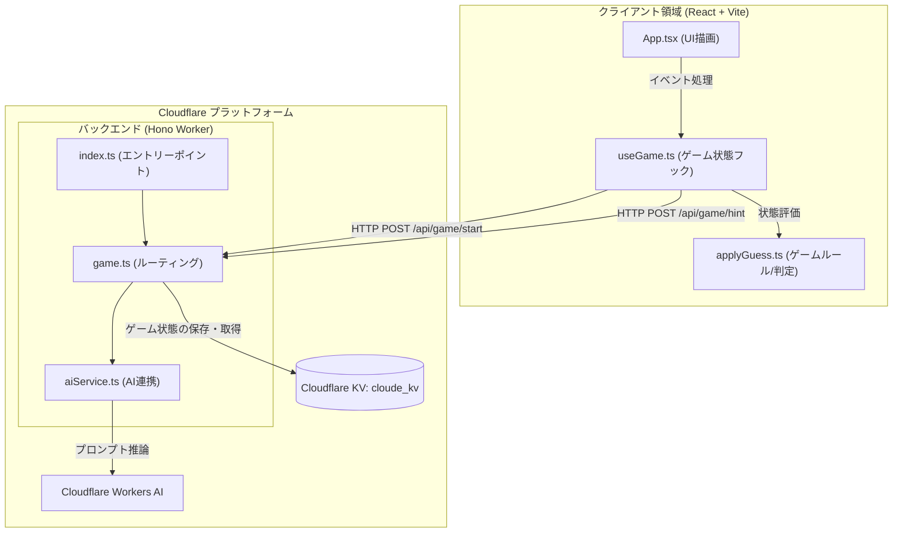

# システムアーキテクチャ & シーケンス設計

本ドキュメントでは、1人プレイ用コードネーム風ボードゲーム「Cloude」のシステムアーキテクチャやシーケンス図を作成

---

## 1. システムアーキテクチャ図

クライアントサイド（Vite + React）とサーバーサイド（Cloudflare Workers + Hono）が、Cloudflare KV と Workers AI を介してどのように連携しているかを示します。

---

## 2. シーケンス図

### 2.1 新規ゲーム開始シーケンス
ゲームの開始時にボード（単語・スパイ配置）と最初のヒントを Workers AI で生成し、状態を保存・返却するまでの流れです。主に、`api/game/start` 周りの内容を指す。

```mermaid
sequenceDiagram
    autonumber
    actor User as プレイヤー
    participant Client as クライアント (React)
    participant Worker as バックエンド (Hono Worker)
    participant KV as Cloudflare KV
    participant AI as Workers AI

    User ->> Client: 「ゲームをスタート」クリック
    Client ->> Worker: POST /api/game/start
    
    rect rgb(20, 30, 45)
        Note over Worker, AI: ボード単語生成
        Worker ->> AI: ボード単語生成要求 (9つの単語、正解/スパイ/一般)
        AI -->> Worker: 生成されたボード単語データ
    end

    rect rgb(20, 30, 45)
        Note over Worker, AI: 初期ヒント生成
        Worker ->> AI: 初期ヒント生成要求 (正解単語リスト vs スパイ単語リスト)
        AI -->> Worker: ヒント・枚数テキスト
    end

    Note over Worker: ゲーム状態 (GameState) オブジェクトの構築
    Worker ->> KV: セッションIDをキーに GameState を保存
    Worker -->> Client: 初期 GameState (JSON)
    Client -->> User: 初期ボードとヒントを表示
```

---

### 2.2 カード回答 & ヒント更新シーケンス
プレイヤーがカードを選択した際のフロントエンド即時判定、および推測回数がなくなった場合の次のAIヒント取得の流れです。主に、`api/game/hint` 周りの内容を指す。

```mermaid
sequenceDiagram
    autonumber
    actor User as プレイヤー
    participant Client as クライアント (React)
    participant Rule as ゲームルール (applyGuess)
    participant Worker as バックエンド (Hono Worker)
    participant KV as Cloudflare KV
    participant AI as Workers AI

    User ->> Client: カードをめくる (単語の選択)
    Client ->> Rule: applyGuess(gameState, word) の実行
    Note over Client: 即座にフロントエンド側で正誤判定

    alt スパイ単語をめくってしまった場合
        Client -->> User: ゲームオーバー (敗北)
    else すべての正解単語をめくった場合
        Client -->> User: ゲームクリア (勝利)
    else 正解単語だが、推測回数が残っている場合
        Client -->> User: めくったカードの色を「正解」にし、推測回数を減らして継続
    else 推測回数が 0 になった場合 (かつ未クリア・ゲーム継続中)
        Note over Client: 次のヒント要求処理を開始
        Client ->> Worker: POST /api/game/hint
        Worker ->> KV: セッションIDから現在のGameStateを取得
        
        rect rgb(20, 30, 45)
            Note over Worker, AI: 次のヒント生成
            Worker ->> AI: 次のヒント生成要求 (未開示の正解単語 vs スパイ単語)
            AI -->> Worker: 新しいヒント・枚数テキスト
        end
        
        Worker ->> KV: 更新したGameStateを保存
        Worker -->> Client: 新しいヒントと推測回数を返却
        Client -->> User: 新しいヒントと推測回数を表示して継続
    end
```

