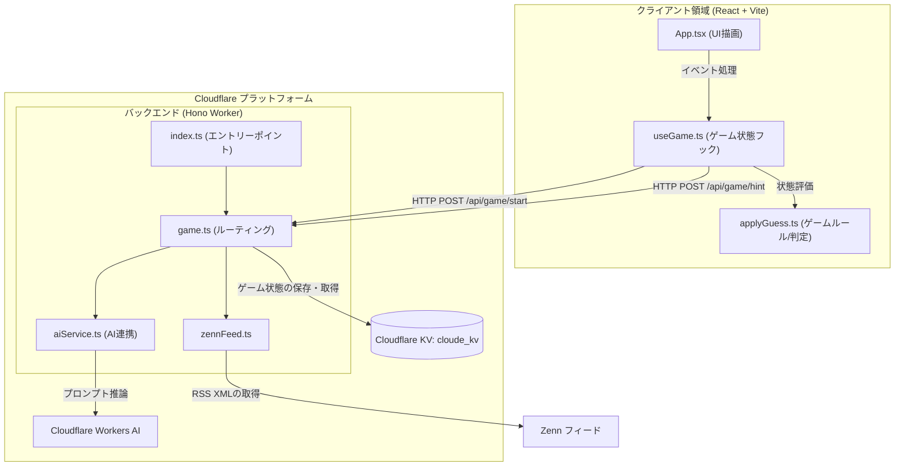
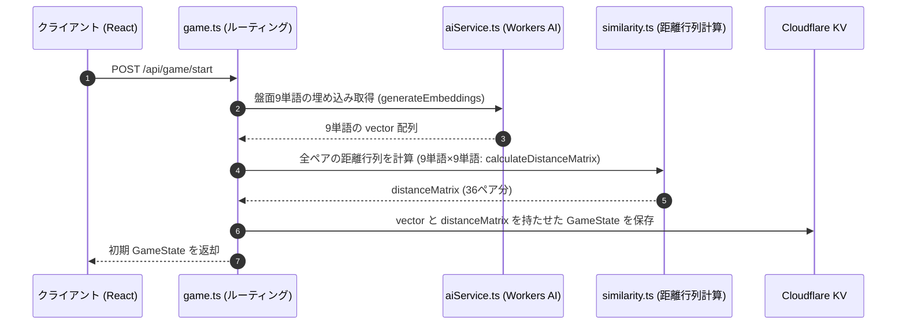

# システムアーキテクチャ & シーケンス設計

本ドキュメントでは、1人プレイ用コードネーム風ボードゲーム「Cloude」の主要なディレクトリ構成、システムアーキテクチャおよび主要なインタラクションシーケンスを解説します。

---

## 主要なディレクトリ構成

```
.
├── docs/                     # ドキュメント
├── public/                   # 画像
├── src/                      # フロントエンド（React + Vite）
│   ├── components/           # UIコンポーネント
│   │   ├── ui/               # shadcn/uiコンポーネント
│   │   ├── GameBoard.tsx     # カードボード表示
│   │   ├── GameStatusOverlay.tsx # 勝敗などのオーバーレイ
│   │   └── Header.tsx        # ロゴ・タイトル表示
│   ├── hooks/                # カスタムフック
│   │   └── useGame.ts        # UI状態とAPI連携、ターン遷移の管理
│   ├── lib/                  # フロントエンドのロジック
│   │   ├── gameRules.ts      # 回答時の状態遷移・勝敗判定
│   │   └── hintParser.ts     # ヒントテキストの抽出
│   └── types/                # 共通の型定義
│       └── game.ts
└── worker/                   # バックエンド（Cloudflare Workers + Hono）
    ├── lib/                  # バックエンドのロジック
    │   ├── hintParser.ts     # AIが返したヒントテキストの解釈
    │   ├── jsonParser.ts     # AIレスポンス(JSON/マークダウン)の安全なパース
    │   ├── similarity.ts     # Embedding(ベクトル類似度)によるヒント検閲・判定
    │   └── validation.ts     # ボード状態やAI出力スキーマの検証
    ├── routes/               # APIルーティング
    │   └── game.ts           # ゲーム関連のAPI
    ├── services/             # 外部サービス連携
    │   ├── aiService.ts      # Cloudflare Workers AI の呼び出し
    │   └── zennFeed.ts       # Zenn RSS フィードからのトレンドタイトル取得
    └── index.ts              # Workerのエントリーポイント
```

---

## 1. システムアーキテクチャ図

クライアントサイド（Vite + React）とサーバーサイド（Cloudflare Workers + Hono）が、Cloudflare KV と Workers AI を介してどのように連携しているかを示す



---

## 2. シーケンス図

### 2.1 新規ゲーム開始シーケンス
ゲームの開始時に Zenn RSS フィードからトレンド記事タイトルを取得し、その単語キーワードを含むボード（単語・スパイ配置）および最初のヒントを Workers AI で生成して状態を保存・返却するまでの流れです。主に、`api/game/start` 周りの内容を指す。

```mermaid
sequenceDiagram
    autonumber
    actor User as プレイヤー
    participant Client as クライアント (React)
    participant Worker as バックエンド (Hono Worker)
    participant Zenn as Zenn RSS (zennFeed.ts)
    participant KV as Cloudflare KV
    participant AI as Workers AI

    User ->> Client: 「ゲームをスタート」クリック
    Client ->> Worker: POST /api/game/start
    
    rect rgb(20, 30, 45)
        Note over Worker, Zenn: トレンドタイトルの取得
        Worker ->> Zenn: Zenn RSSフィードの取得・タイトル抽出
        Zenn -->> Worker: 記事タイトル一覧 (ランダムに3件選出)
    end

    rect rgb(20, 30, 45)
        Note over Worker, AI: ボード単語生成
        Worker ->> AI: ボード単語生成要求 (Zenn3タイトルキーワード + 6別ジャンル単語、正解/スパイ割り当て)
        AI -->> Worker: 生成されたボード単語データ
    end

    rect rgb(20, 30, 45)
        Note over Worker, AI: 盤面9単語の埋め込み取得 & 距離行列計算
        Worker ->> AI: 9単語のベクトル化要求 (@cf/baai/bge-base-en-v1.5)
        AI -->> Worker: 9単語の vector 配列
        Note over Worker: 全ペアの距離行列を計算 (9単語×9単語: distanceMatrix 36ペア分)
    end

    Note over Worker: 各カードの vector および distanceMatrix を含む GameState の構築
    Worker ->> KV: セッションIDをキーに GameState を保存
    Worker -->> Client: 初期 GameState (JSON)
    Client -->> User: 初期ボードを表示
```



---

### 2.2 カード回答 & ヒント更新シーケンス
プレイヤーがカードを選択した際のフロントエンド即時判定、および推測回数がなくなった場合の次のAIヒント取得の流れです。主に、`api/game/hint` 周りの内容を指す。

```mermaid
sequenceDiagram
    autonumber
    actor User as プレイヤー
    participant Client as クライアント (React)
    participant Rule as ゲームルール (applyGuess)
    participant Worker as バックエンド (Hono Worker)
    participant KV as Cloudflare KV
    participant AI as Workers AI

    User ->> Client: カードをめくる (単語の選択)
    Client ->> Rule: applyGuess(gameState, word) の実行
    Note over Client: 即座にフロントエンド側で正誤判定

    alt スパイ単語をめくってしまった場合
        Client -->> User: ゲームオーバー (敗北)
    else すべての正解単語をめくった場合
        Client -->> User: ゲームクリア (勝利)
    else 正解単語だが、推測回数が残っている場合
        Client -->> User: めくったカードの色を「正解」にし、推測回数を減らして継続
    else 推測回数が 0 になった場合 (かつ未クリア) または 手動で「ヒント再生成」を押した場合
        Note over Client: ヒント要求処理を開始
        Client ->> Worker: POST /api/game/hint
        Worker ->> KV: セッションIDから現在のGameStateを取得
        
        rect rgb(20, 30, 45)
            Note over Worker, AI: 次のヒント生成
            Worker ->> AI: 次のヒント生成要求 (未開示の正解単語 vs スパイ単語)
            AI -->> Worker: 新しいヒント・枚数テキスト
        end
        
        Worker ->> KV: 更新したGameStateを保存
        Worker -->> Client: 新しいヒントと推測回数を返却
        Client -->> User: 新しいヒントと推測回数を表示して継続
    end
```



---

## 3. Embedding (ベクトル埋め込み) による「全ペア距離行列(distanceMatrix)」事前計算アーキテクチャ

### 3.1 概要と狙い
- **従来の課題**: AI（LLM）に自由にヒントと対象単語を選ばせると、AIによる試作・試行錯誤ループが発生し、ゲーム開始時の処理時間が増大する。
- **本手法の狙い**: ゲーム開始時 (`POST /api/game/start`) にて **AIでの試作ヒント生成・リトライを行わず**、盤面9単語の Embedding ベクトル取得と **全ペア（36ペア分）の距離/類似度行列 (`distanceMatrix`) の計算・保持** に限定します。これによりゲーム開始時のレスポンス時間が短縮され、ヒント生成時のグループ抽出が高速化されます。

### 3.2 ゲーム開始時のシーケンス



### 3.3 主な関連ファイルと役割
- **[worker/services/aiService.ts](file:///Users/brainscience/Documents/VSCode/cloude/worker/services/aiService.ts)**
  - `generateEmbeddings`: Workers AI の Embedding モデル (`@cf/baai/bge-base-en-v1.5`) を呼び出し、テキスト単語を数値ベクトル `number[][]` に変換します。
- **[worker/lib/similarity.ts](file:///Users/brainscience/Documents/VSCode/cloude/worker/lib/similarity.ts)**
  - `cosineSimilarity`: 2つのベクトル間のコサイン類似度を算出します。
  - `calculateDistanceMatrix`: 盤面9単語の全ペア（36ペア分）のコサイン類似度行列 `Record<string, number>` を作成します。
  - `validateHintSafety`: ヒントベクトルと盤面単語の類似度からスパイ誤爆リスクを判定します。
- **[worker/routes/game.ts](file:///Users/brainscience/Documents/VSCode/cloude/worker/routes/game.ts)**
  - `POST /start` ルートにて全9単語のベクトル付与および `distanceMatrix` の算出を実行し、`vector` と `distanceMatrix` を含む `GameState` を Cloudflare KV へ保存します。

