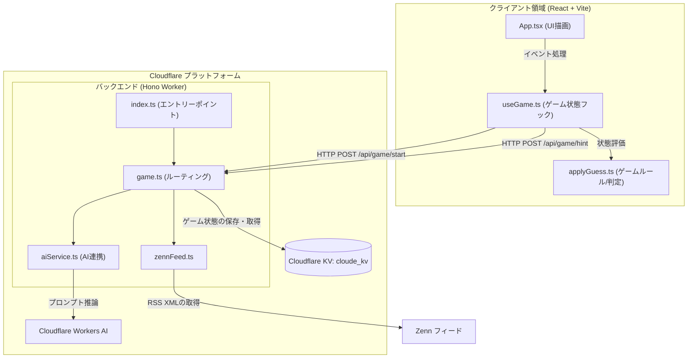
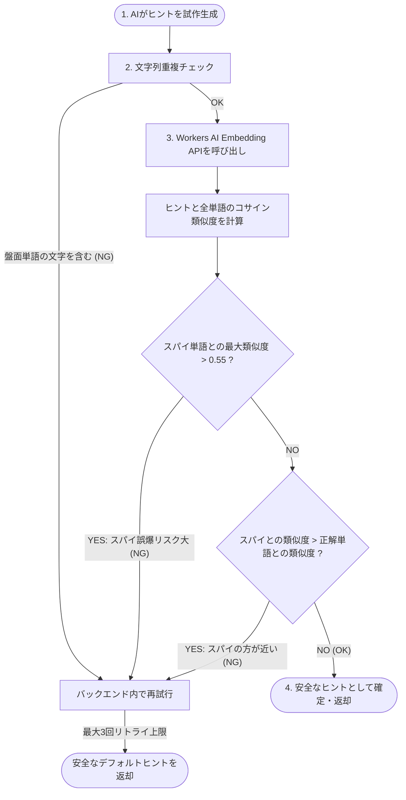

# システムアーキテクチャ & シーケンス設計

本ドキュメントでは、1人プレイ用コードネーム風ボードゲーム「Cloude」の主要なディレクトリ構成、システムアーキテクチャおよび主要なインタラクションシーケンスを解説します。

---

## 主要なディレクトリ構成

```
.
├── docs/                     # ドキュメント
├── public/                   # 画像
├── src/                      # フロントエンド（React + Vite）
│   ├── components/           # UIコンポーネント
│   │   ├── ui/               # shadcn/uiコンポーネント
│   │   ├── GameBoard.tsx     # カードボード表示
│   │   ├── GameStatusOverlay.tsx # 勝敗などのオーバーレイ
│   │   └── Header.tsx        # ロゴ・タイトル表示
│   ├── hooks/                # カスタムフック
│   │   └── useGame.ts        # UI状態とAPI連携、ターン遷移の管理
│   ├── lib/                  # フロントエンドのロジック
│   │   ├── gameRules.ts      # 回答時の状態遷移・勝敗判定
│   │   └── hintParser.ts     # ヒントテキストの抽出
│   └── types/                # 共通の型定義
│       └── game.ts
└── worker/                   # バックエンド（Cloudflare Workers + Hono）
    ├── lib/                  # バックエンドのロジック
    │   ├── hintParser.ts     # AIが返したヒントテキストの解釈
    │   ├── jsonParser.ts     # AIレスポンス(JSON/マークダウン)の安全なパース
    │   ├── similarity.ts     # Embedding(ベクトル類似度)によるヒント検閲・判定
    │   └── validation.ts     # ボード状態やAI出力スキーマの検証
    ├── routes/               # APIルーティング
    │   └── game.ts           # ゲーム関連のAPI
    ├── services/             # 外部サービス連携
    │   ├── aiService.ts      # Cloudflare Workers AI の呼び出し
    │   └── zennFeed.ts       # Zenn RSS フィードからのトレンドタイトル取得
    └── index.ts              # Workerのエントリーポイント
```

---

## 1. システムアーキテクチャ図

クライアントサイド（Vite + React）とサーバーサイド（Cloudflare Workers + Hono）が、Cloudflare KV と Workers AI を介してどのように連携しているかを示す



---

## 2. シーケンス図

### 2.1 新規ゲーム開始シーケンス
ゲームの開始時に Zenn RSS フィードからトレンド記事タイトルを取得し、その単語キーワードを含むボード（単語・スパイ配置）および最初のヒントを Workers AI で生成して状態を保存・返却するまでの流れです。主に、`api/game/start` 周りの内容を指す。

```mermaid
sequenceDiagram
    autonumber
    actor User as プレイヤー
    participant Client as クライアント (React)
    participant Worker as バックエンド (Hono Worker)
    participant Zenn as Zenn RSS (zennFeed.ts)
    participant KV as Cloudflare KV
    participant AI as Workers AI

    User ->> Client: 「ゲームをスタート」クリック
    Client ->> Worker: POST /api/game/start
    
    rect rgb(20, 30, 45)
        Note over Worker, Zenn: トレンドタイトルの取得
        Worker ->> Zenn: Zenn RSSフィードの取得・タイトル抽出
        Zenn -->> Worker: 記事タイトル一覧 (ランダムに3件選出)
    end

    rect rgb(20, 30, 45)
        Note over Worker, AI: ボード単語生成
        Worker ->> AI: ボード単語生成要求 (Zenn3タイトルキーワード + 6別ジャンル単語、正解/スパイ割り当て)
        AI -->> Worker: 生成されたボード単語データ
    end

    rect rgb(20, 30, 45)
        Note over Worker, AI: 初期ヒント生成
        Worker ->> AI: 初期ヒント生成要求 (正解単語リスト vs スパイ単語リスト)
        AI -->> Worker: ヒント・枚数テキスト
    end

    Note over Worker: ゲーム状態 (GameState) オブジェクトの構築
    Worker ->> KV: セッションIDをキーに GameState を保存
    Worker -->> Client: 初期 GameState (JSON)
    Client -->> User: 初期ボードとヒントを表示
```



---

### 2.2 カード回答 & ヒント更新シーケンス
プレイヤーがカードを選択した際のフロントエンド即時判定、および推測回数がなくなった場合の次のAIヒント取得の流れです。主に、`api/game/hint` 周りの内容を指す。

```mermaid
sequenceDiagram
    autonumber
    actor User as プレイヤー
    participant Client as クライアント (React)
    participant Rule as ゲームルール (applyGuess)
    participant Worker as バックエンド (Hono Worker)
    participant KV as Cloudflare KV
    participant AI as Workers AI

    User ->> Client: カードをめくる (単語の選択)
    Client ->> Rule: applyGuess(gameState, word) の実行
    Note over Client: 即座にフロントエンド側で正誤判定

    alt スパイ単語をめくってしまった場合
        Client -->> User: ゲームオーバー (敗北)
    else すべての正解単語をめくった場合
        Client -->> User: ゲームクリア (勝利)
    else 正解単語だが、推測回数が残っている場合
        Client -->> User: めくったカードの色を「正解」にし、推測回数を減らして継続
    else 推測回数が 0 になった場合 (かつ未クリア) または 手動で「ヒント再生成」を押した場合
        Note over Client: ヒント要求処理を開始
        Client ->> Worker: POST /api/game/hint
        Worker ->> KV: セッションIDから現在のGameStateを取得
        
        rect rgb(20, 30, 45)
            Note over Worker, AI: 次のヒント生成
            Worker ->> AI: 次のヒント生成要求 (未開示の正解単語 vs スパイ単語)
            AI -->> Worker: 新しいヒント・枚数テキスト
        end
        
        Worker ->> KV: 更新したGameStateを保存
        Worker -->> Client: 新しいヒントと推測回数を返却
        Client -->> User: 新しいヒントと推測回数を表示して継続
    end
```



---

## 3. Embedding (ベクトル埋め込み) によるAIヒント検閲・ガードレール

### 3.1 Embedding とは？
Embedding（ベクトル埋め込み）とは、**単語や文章の意味・概念を「多次元の数値リスト（ベクトル）」に変換する技術**です。

- **従来の文字列比較**: 「公園」と「サファリパーク」は文字が違うため関係がないと判定されたり、逆に「公園」と「フラメンコ」の概念的な近さを文字から判定することは困難。
- **Embedding（ベクトル化）**: 単語を「意味の位置」に配置するため、数学的な距離（コサイン類似度: 0.0〜1.0）を計算できます。
  - 例: `コサイン類似度("公園", "サファリパーク") ≒ 0.65` （近い）
  - 例: `コサイン類似度("公園", "フラメンコ") ≒ 0.48` （連想され得る距離）
  - 例: `コサイン類似度("公園", "GPU") ≒ 0.12` （無関係）

---

### 3.2 ガードレール & 自動リトライ（Self-Correction Loop）の流れ

AI（LLM）のプロンプトだけに頼ると、「BM25はアルコール度数の単位ではないがアルコール関係」のような虚構の捏造や、「公園」と「フラメンコ」のようなスパイへの誤爆連想が発生します。

そのため、バックエンド (`aiService.ts` + `similarity.ts`) のプログラム側で以下の二重検閲を行い、NGの場合は自動的にAIへリトライ（再生成）を行います。


