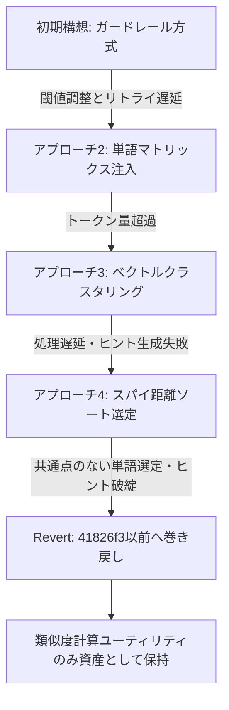

# Embedding によるヒント検証・最適化の検証結果報告

ブランチ: `feat/hint-validation-embedding`  
対象機能: Cloudflare Workers AI の Embedding モデルを活用したヒント生成の安全性検証および最適化

---

## 1. 概要

本ブランチでは、ゲームマスターAIが生成するヒントがスパイ単語を誤って連想させ、プレイヤーが即座に敗北する「スパイ誤爆リスク」を低減させるため、Cloudflare Workers AI の埋め込みモデル（`@cf/baai/bge-base-en-v1.5`）とコサイン類似度を用いた検証を行った。

複数パターンのアプローチ（事後ガードレール検証、事前マトリックス注入、クラスタリング、スパイ距離ソート）を実装・検証したが、レスポンス速度の低下や「ヒントなし」の頻発、意味不明なヒント生成などの課題が顕在化した。最終的に実用上の品質担保が困難と判断し、関連変更を巻き戻し（revert）、コサイン類似度の計算ユーティリティ（[worker/lib/similarity.ts](file:///Users/brainscience/Documents/VSCode/cloude/worker/lib/similarity.ts)）のみを今後の基盤資産として残す決定を行った。

---

## 2. 背景と動機

1人プレイ用コードネーム風ゲーム「Cloude」において、AIは盤面上の複数の正解単語を結びつけるヒントを生成する。しかし以下の課題が存在していた：

1. **スパイ誤爆リスク**: プロンプトで「スパイ単語を連想させないこと」を指示しても、LLMの確率的出力やハルシネーションにより、スパイ単語に近いヒントが出力されるケースがあった。
2. **定量的評価の欠如**: プロンプトの指示のみに頼ると、ヒントとスパイ単語の意味的距離が客観的にどの程度離れているかを判定・制御できなかった。

これらを解決するため、Embedding（ベクトル埋め込み）によるコサイン類似度を用いて、機械的に安全性を検証・制御する機構の構築を試みた。

---

## 3. 試行したアプローチと検証経緯

### アプローチ1: 試作ヒント生成 + 事後ガードレール検証・リトライ
- **コミット**: `41826f3`, `39bacfa`, `5e4a1af`, `650e57c`
- **設計内容**:
  1. ゲーム開始時に盤面9単語のベクトルを事前取得。
  2. LLMに試作ヒントを生成させる。
  3. 試作ヒント単語をベクトル化し、スパイ単語とのコサイン類似度を比較。
  4. スパイとの最大類似度が閾値（`0.55`）を超えている、または正解単語の最大類似度よりスパイ単語の方が近い場合、不安全と判定して再生成（最大3回リトライ）。
- **結果・課題**:
  - 閾値判定がシビアであり、リトライ上限（3回）を超えて「ヒントなし」にフォールバックする頻度が高くなった。
  - ヒントの精度が高まった感じはあった
  - リトライごとにLLM推論＋Embedding API呼び出しが発生し、ゲーム開始のレイテンシが大幅に悪化したため、UX悪化の方が大きい課題だと感じた。

### アプローチ2: 単語間類似度マトリックスの事前作成とプロンプト注入
- **コミット**: `e44becb`, `065e0c0`
- **設計内容**:
  - 正解単語同士、および正解単語とスパイ単語の全ペア類似度マトリックスを事前に計算。
  - 互いに類似度が高く安全な単語の組み合わせのみをフィルタリングし、ヒント生成プロンプトへコンテキストとして注入。
- **結果・課題**:
  - 類似度情報や組み合わせリストをプロンプトに含めることで文章量・トークン数が超過し、コンテキスト肥大化と推論コストの増大を招いた。

### アプローチ3: ベクトル空間上のクラスタリングによる正解単語グループ化
- **コミット**: `d0ad20e`
- **設計内容**:
  - `worker/lib/clustering.ts` を新設。正解単語ベクトルを階層的または距離ベースでクラスタリングし、意味的にまとまっている2〜3単語を特定してプロンプトに指定。
- **結果・課題**:
  - Cloudflare Workers 上でのクラスタリング計算および関連処理により処理時間が大幅に遅延。
  - 機械的に分類されたグループが人間的な感覚と合致せず、LLMがそのグループに対する適切なヒントを生成できず「ヒントなし」となるケースが多発。

### アプローチ4: スパイ単語距離（`spySimilarity`）による安全単語の事前選定
- **コミット**: `796861b`, `94ac92b`, `5055aef`
- **設計内容**:
  - 各正解単語について、全スパイ単語とのコサイン類似度の最大値（`spySimilarity`）を算出。
  - スパイから最も遠い（安全度が高い）上位2〜3単語を優先選定し、プロンプトの対象単語として指定。
- **結果・課題**:
  - 「スパイから遠い」という基準だけで選ばれた単語群（例: 「公園」と「GPU」）は、相互の関連性が希薄であるため、LLMが共通項を見出せずヒント生成に失敗（「ヒントなし」）した。
  - 無理に共通点を出力させようとした結果、不自然で意味不明な単語や理由（reasoning）が出力される事態となった。また、UnicodeエスケープシーケンスやJSONパースの破綻も副次的に発生した。

---

## 4. 直面した技術的課題の分析

| 課題項目 | 詳細 |
| :--- | :--- |
| **Embeddingモデルの言語適性** | 利用したモデル（`@cf/baai/bge-base-en-v1.5`）は主に英語をターゲットとしており、日本語単語の意味空間の分解能が不十分であった。 |
| **「類似度」と「共通点（連想）」の乖離** | コサイン類似度が高いペアは同義語・類似分野に偏りやすく、コードネーム特有の「一見異なる2語を意外な共通概念でまとめる」連想ゲームの面白さや柔軟性と対立した。 |
| **事前選定の破綻** | ベクトル側で単語の組み合わせを先に決めてしまうと、LLM側が連想の余地を失い、「ヒントなし」やハルシネーションを誘発した。 |
| **パフォーマンスとコスト** | Embedding生成とLLM再試行の多段呼び出しにより、API応答時間が許容レベルを超過した。 |

---

## 5. 最終決定と現在のブランチ状態

以上の結果を踏まえ、コミット `2a15826` において、`41826f3` 以前の安定した状態へとコードを復元（revert）した。

### 残存資産
- **[worker/lib/similarity.ts](file:///Users/brainscience/Documents/VSCode/cloude/worker/lib/similarity.ts)**:
  - ベクトル間のコサイン類似度を算出する汎用関数（`cosineSimilarity`）
  - スパイ単語との最高類似度を付与する計算ロジック（`calculateBoardSpySimilarities`）
- **[worker/lib/similarity.test.ts](file:///Users/brainscience/Documents/VSCode/cloude/worker/lib/similarity.test.ts)**:
  - 上記の単体テスト（正常系・境界値テスト）

---

## 6. 今後の展望・改善に向けた示唆

Embedding による安全性担保やヒント品質向上を再訪する場合、以下の方向性が推奨される：

1. **多言語/日本語特化Embeddingモデルの採用**:
   - 日本語の語彙や文脈を正確に捉えられる多言語対応モデル（例: `multilingual-e5` 等）の利用を検討する。
2. **事前選定ではなく「事後評価（リランキング）」への適用**:
   - 単語を事前に機械選定するのではなく、LLMに複数候補（ヒント＋対象単語）を出力させ、スパイ誤爆の危険度スコアをバックグラウンドで計算して最善の候補を選ぶ方式。
3. **プロンプトエンジニアリングの強化**:
   - スパイ回避ルールをCoT（Chain of Thought）形式でLLMに自己検証させ、スパイ単語と関連しない理由をステップバイステップで確認させる。
